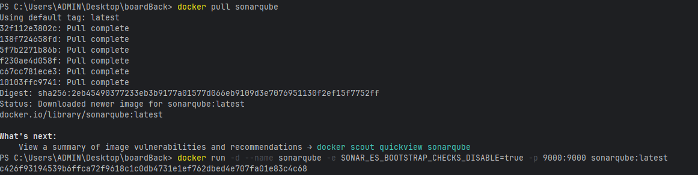
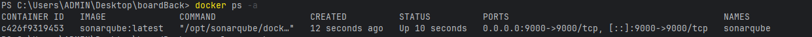
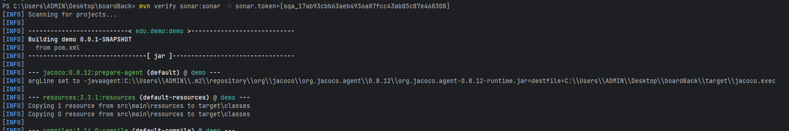
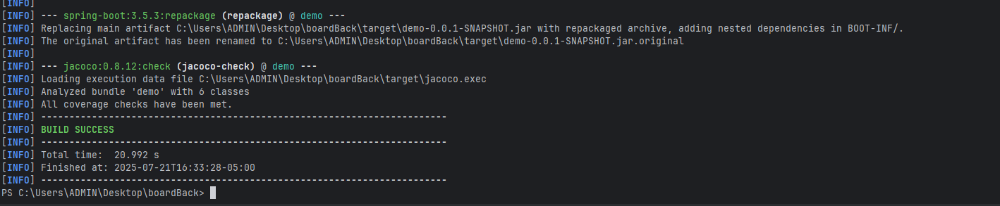
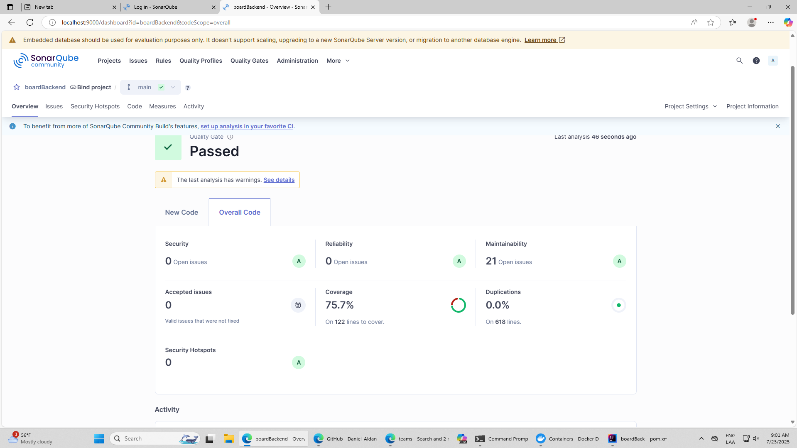
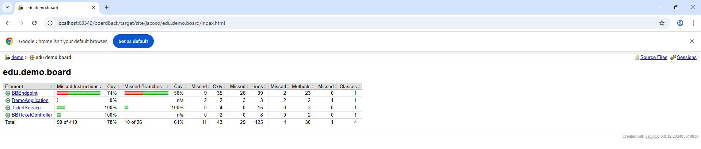

# Collaborative Drawing Board Backend

This project is the backend for a real-time collaborative drawing board application. It provides secure WebSocket communication for drawing events, user authentication via Google, and a ticket-based system to ensure only authenticated users can participate.

## Features
- **Real-time collaborative drawing** using WebSocket (Java, Spring Boot)
- **Google login** (OAuth2/JWT) for secure user authentication
- **Ticket-based WebSocket authentication**: one-time-use tickets issued per user session
- **Draw history**: new users see the current board state upon joining
- **Redis integration** for ticket storage and validation
- **CORS and security**: only authenticated users can obtain tickets

## How Authentication and Ticketing Works
1. **User logs in with Google** on the frontend and obtains a Google ID token (JWT).
2. **Frontend requests a ticket** from the backend by sending a POST to `/api/ws-ticket` with the JWT in the `Authorization` header.
3. **Backend validates the JWT** and issues a one-time-use ticket, stored in Redis for 5 minutes.
4. **Frontend opens a WebSocket** connection and sends the ticket as the first message.
5. **Backend validates the ticket** (removing it from Redis to prevent reuse). If valid, the user is authenticated and receives the current draw history.
6. **Drawing events** are broadcast to all connected users in real time.

## API Endpoints

### `POST /api/ws-ticket`
- **Description:** Issues a one-time-use ticket for WebSocket authentication.
- **Authentication:** Requires a valid Google JWT in the `Authorization` header.
- **Request:** No body required.
- **Response:**
  ```json
  { "ticket": "uuid-string" }
  ```

## Technologies Used
- **Java 17+ / Spring Boot**
- **Spring Security (OAuth2 Resource Server, JWT)**
- **WebSocket (Jakarta WebSocket API)**
- **Redis** (for ticket storage)

## Running the Project

### Prerequisites
- Java 17+

### Backend
1. Clone the repository.
2. Configure your `application.properties`:
   - Set your allowed frontend origin for CORS.
   - Configure Redis connection if not using default.
   - Set up Google OAuth2 issuer if needed.
3. Build and run the Spring Boot application:
   ```bash
   ./mvnw spring-boot:run
   ```

## Contributing
Pull requests are welcome! For major changes, please open an issue first to discuss what you would like to change.

## License
This project is licensed under the MIT License.

# SonarQube With Docker

## Install image of sonar

## Validating operation

## Integration with Sonar

## Results

## Sonar

## Jacoco
